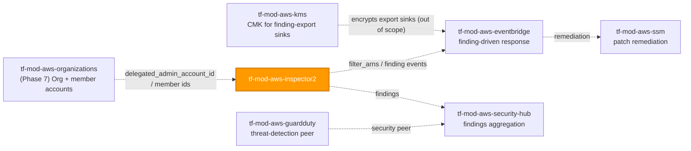
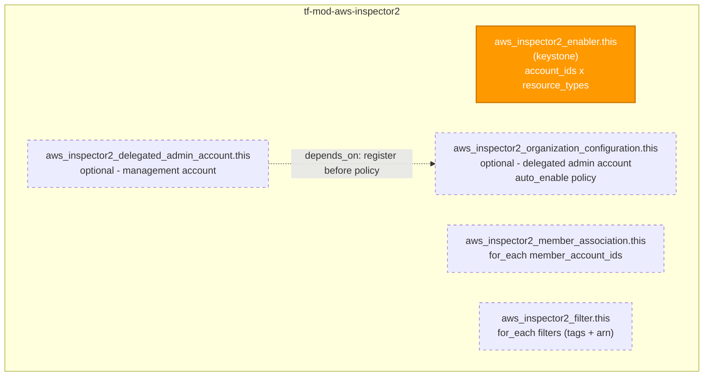

# 🟧 AWS **Inspector v2** Terraform Module

> **Turns on Amazon Inspector continuous vulnerability scanning in one call — the regional scan enabler (the keystone), plus optional Organizations delegated-administrator registration, an org-wide auto-enable policy, member associations, and suppression filters — all least-privilege-scoped and secure-by-default.** Built for the AWS provider **v6.x**.

[](https://www.terraform.io)
[](https://registry.terraform.io/providers/hashicorp/aws/latest)
[](#)
[](#)
[](#)

---

## 🧩 Overview

- 🔍 **Vulnerability scanning, fully wired.** Creates `aws_inspector2_enabler` (the keystone) plus the four control-plane resources that surround it: delegated-administrator registration, the organization auto-enable policy, member associations, and finding suppression filters.
- 🎯 **Least-privilege by design.** `resource_types` has **no wildcard-all** convenience value — the caller must enumerate exactly which of `EC2` / `ECR` / `LAMBDA` / `LAMBDA_CODE` / `CODE_REPOSITORY` to scan. Explicit scanning scope *is* the secure-by-default posture here.
- 🧯 **Guardrails at plan time.** `LAMBDA_CODE` without `LAMBDA` is blocked before apply (both for the enabler `resource_types` and the org `auto_enable` block), account IDs are validated 12-digit, and "required-when-enabled" inputs fail fast.
- 🏢 **Organizations-aware, account-boundary-honest.** Delegated-admin registration runs from the **management** account; the org auto-enable policy runs from the **delegated administrator** account. The module declares both as **independently toggleable** switches rather than faking a two-provider split — you point each invocation at the correct provider.
- 🧮 **Collections as data.** `member_account_ids` and `filters` are `map(object(...))` rendered with `for_each`, keyed by stable caller strings.
- 🏷️ **Tags where they actually exist.** Of the five Inspector2 resources, **only `aws_inspector2_filter`** supports `tags` / `tags_all` / `arn` in the provider — `var.tags` flows to filters only, and `filter_tags_all` is surfaced. This is a **verified provider limitation**, documented honestly rather than faked across the untaggable resources.

> 💡 **Why it matters:** Inspector is the account's always-on vulnerability sensor — it continuously scans EC2 hosts, ECR images, Lambda functions/code, and connected code repositories against the AWS vulnerability intelligence database and surfaces prioritized, EPSS-scored findings. For an FI under regulatory oversight running PII-bearing workloads, scanning that is enabled on exactly the intended resource types, auto-enabled for new org accounts, and centrally administered is a core regulated-industry control. One consistent module keeps that posture identical across every account and Region.

---

## ❤️ Support this project

If these Terraform modules have been helpful to you or your organization, I'd appreciate your support in any of the following ways:

- ⭐ **Star this repository** to help others discover this Terraform module.
- 🤝 **Connect with me on LinkedIn:** [linkedin.com/in/microsoftexpert](https://www.linkedin.com/in/microsoftexpert)
- ☕ **Buy me a coffee:** [buymeacoffee.com/microsoftexpert](https://buymeacoffee.com/microsoftexpert)

Whether it's a star, a professional connection, or a coffee, every gesture helps keep these modules actively maintained and continually improving. Thank you for being part of the community!

---

## 🗺️ Where this fits in the family

`tf-mod-aws-inspector2` is a **security-enablement consumer** — it reads an existing Organization structure (account IDs) and feeds findings downstream to aggregation and finding-driven response. It creates no bucket, key, or compute of its own.



---

## 🧬 What this module builds



| Resource | Count | Created when |
|---|---|---|
| `aws_inspector2_enabler.this` | 0 or 1 | `enable_scanning = true` (default) — the keystone |
| `aws_inspector2_delegated_admin_account.this` | 0 or 1 | `enable_delegated_admin = true` (management account) |
| `aws_inspector2_organization_configuration.this` | 0 or 1 | `enable_organization_configuration = true` (delegated-admin account) |
| `aws_inspector2_member_association.this` | 0..N | one per `member_account_ids` entry |
| `aws_inspector2_filter.this` | 0..N | one per `filters` entry (**only taggable resource**) |

> ℹ️ Each resource is an independent toggle — a single invocation may create any subset. The enabler is the keystone but is itself guarded by `enable_scanning` so the module can also be invoked purely for delegated-admin or org-configuration work from an account where you do not want to enable scanning in the same call.

---

## ✅ Provider / Versions

| Requirement | Version |
|---|---|
| Terraform | `>= 1.12.0` |
| `hashicorp/aws` | `>= 6.0, < 7.0` |

The module declares only a `required_providers` block (`providers.tf`) and inherits the configured provider. There is **no `provider {}` block**, **no `configuration_aliases`**, and **no credential variable** — credentials resolve through the standard AWS chain at the root/pipeline level (env vars → SSO/shared credentials → `assume_role` → instance profile / IRSA → OIDC web identity). Inspector v2 is **regional**: every resource is created in the inherited provider's Region. To cover multiple Regions, instantiate this module once per Region with provider aliases.

---

## 🔑 Required IAM Permissions

Least-privilege actions the **Terraform execution identity** needs. The delegated-admin and org-configuration paths run from **different accounts** (management vs. delegated administrator) and pull in `organizations:*` actions alongside `inspector2:*`.

| Action | Required for | Notes |
|---|---|---|
| `inspector2:Enable`, `inspector2:Disable`, `inspector2:BatchGetAccountStatus` | `aws_inspector2_enabler` lifecycle / read-back | Only when `enable_scanning = true` |
| `inspector2:EnableDelegatedAdminAccount`, `inspector2:DisableDelegatedAdminAccount`, `inspector2:GetDelegatedAdminAccount`, `inspector2:ListDelegatedAdminAccounts` | `aws_inspector2_delegated_admin_account` lifecycle / read | Management account only |
| `organizations:EnableAWSServiceAccess`, `organizations:RegisterDelegatedAdministrator`, `organizations:DeregisterDelegatedAdministrator`, `organizations:ListDelegatedAdministrators`, `organizations:ListAWSServiceAccessForOrganization`, `organizations:DescribeOrganization`, `organizations:DescribeAccount` | Delegated-admin registration is an **Organizations-service** action, not purely an Inspector one | Run from the **management account** |
| `inspector2:UpdateOrganizationConfiguration`, `inspector2:DescribeOrganizationConfiguration` | `aws_inspector2_organization_configuration` | Run from the **delegated administrator account** |
| `inspector2:AssociateMember`, `inspector2:DisassociateMember`, `inspector2:GetMember`, `inspector2:ListMembers` | `aws_inspector2_member_association` | Only when `member_account_ids` is set |
| `inspector2:CreateFilter`, `inspector2:UpdateFilter`, `inspector2:DeleteFilter`, `inspector2:ListFilters` | `aws_inspector2_filter` lifecycle | Only when `filters` is set |
| `inspector2:TagResource`, `inspector2:UntagResource`, `inspector2:ListTagsForResource` | Filter tagging | **Filters only** — the other four resources accept no tags |

> ℹ️ **No `iam:PassRole`.** This module passes no IAM role. ECR/EC2/Lambda scanning relies on Inspector's own service-linked role and on service permissions already present for those resources.

> ℹ️ **`inspector2:TagResource` is meaningful only for filters.** The enabler, delegated-admin, org-configuration, and member-association resources accept no `tags` argument in the provider schema (verified against `hashicorp/aws` v6.53.0), so the tagging actions apply solely to `aws_inspector2_filter`.

---

## 📋 AWS Prerequisites

- **Service enablement is per-Region.** Every resource acts on the provider's Region. There is no global Inspector2 module — enable each Region by invoking this module once per Region (directly or via a provider alias). **No `us-east-1` global-resource coupling** exists (Inspector is purely regional).
- **Service-linked role.** Inspector uses `AWSServiceRoleForAmazonInspector2`, auto-created via `iam:CreateServiceLinkedRole` on first enablement. No customer role is passed.
- **Organizations — all features enabled.** Before `aws_inspector2_delegated_admin_account` can succeed, the management account's Organization must have **all features enabled** (not just consolidated billing), and `organizations:EnableAWSServiceAccess` for `inspector2.amazonaws.com` must be granted. This trusted-access toggle is a one-time, one-way Organizations action performed alongside — but outside — this module.
- **Delegated administrator is a singleton per Organization, but per-Region in enforcement.** An Organization has exactly one Inspector delegated administrator, and it must be designated **in every Region** where Inspector is used org-wide. Re-apply `aws_inspector2_delegated_admin_account` per Region via provider aliases.
- **Order of operations across accounts.** `aws_inspector2_delegated_admin_account` (management account) must exist **before** `aws_inspector2_organization_configuration` (delegated-admin account) can be applied — the provider enforces this at the API level, not at plan time. When both are created in one call the module encodes the ordering with `depends_on`; across separate invocations, apply the management-account call first.
- **Quotas.** A delegated administrator supports up to **10,000** member accounts (up to **50,000** with an org-wide policy, though accounts beyond 10,000 are scanned but not visible in the delegated-admin console/API). `organization_max_account_limit_reached` surfaces when the ceiling is hit.

---

## 📁 Module Structure

```
tf-mod-aws-inspector2/
├── providers.tf # required_providers (aws >= 6.0, < 7.0); no provider block; no configuration_aliases
├── variables.tf # enable_scanning/account_ids/resource_types → delegated-admin → org-config → members → filters → tags → timeouts
├── main.tf # enabler (this, keystone) + delegated-admin + org-config + member associations + filters
├── outputs.tf # enabler state + delegated-admin/org-config attrs + member maps + filter id/arn/tags_all
├── README.md # this file
└── SCOPE.md # in/out-of-scope, IAM permissions, prerequisites, gotchas, secure defaults
```

---

## ⚙️ Quick Start

Smallest secure single-account call — enable scanning for this account on the intended resource types:

```hcl
module "inspector2" {
  source = "git::https://github.com/microsoftexpert/tf-mod-aws-inspector2?ref=v1.0.0"

  account_ids    = [data.aws_caller_identity.current.account_id]
  resource_types = ["EC2", "ECR", "LAMBDA"] # explicit, least-privilege scope — no wildcard-all

  tags = {
    Environment = "prod"
    CostCenter  = "1234"
  }
}
```

---

## 🔌 Cross-Module Contract

### Consumes

| Input | Type | Source |
|---|---|---|
| `account_ids` | `set(string)` (account IDs) | Caller / `data.aws_caller_identity` / `data.aws_organizations_organization` |
| `delegated_admin_account_id` | `string` (account ID) | A known member/security account ID (not a `tf-mod-aws-organizations` output — Phase 7) |
| `member_account_ids` (map keys / `account_id`) | `string` (account IDs) | Caller-supplied existing member/child account IDs |

### Emits

| Output | Description | Consumed by |
|---|---|---|
| `id` | Synthetic composite id of the enabler (`[account_ids]-[resource_types]`) — state only, not an AWS ARN | Audit / state inspection |
| `enabled_account_ids` | Account IDs scanning was enabled for | Compliance reporting |
| `enabled_resource_types` | Resource types being scanned | Compliance reporting, Security Hub cross-check |
| `delegated_admin_account_id` | Registered delegated admin account (`null` if unused) | `tf-mod-aws-guardduty` / `tf-mod-aws-security-hub` (same org security admin) |
| `delegated_admin_relationship_status` | Delegated-admin registration status (`null` if unused) | Drift / health monitoring |
| `organization_auto_enable` | Applied `auto_enable` policy object (`null` if unused) | Compliance reporting |
| `organization_max_account_limit_reached` | Whether the org hit the account ceiling (`null` if unused) | Alerting near the 10,000-account limit |
| `member_association_ids` / `member_association_account_ids` / `member_association_statuses` | Maps keyed by member key | Membership audit / health monitoring |
| `filter_ids` / `filter_arns` | Maps of filter name → id / ARN — the **only** genuine ARNs here | `tf-mod-aws-eventbridge` and modules referencing filters by ARN |
| `filter_tags_all` | Map of filter name → merged `tags_all` | Governance / audit (filters only) |

---

## 📚 Example Library

<details>
<summary><strong>1 · Minimal single-account enablement (explicit scope)</strong></summary>

```hcl
module "inspector2" {
  source = "git::https://github.com/microsoftexpert/tf-mod-aws-inspector2?ref=v1.0.0"

  account_ids    = ["123456789012"] # this account (self)
  resource_types = ["EC2", "ECR"]   # scan hosts + container images only
  # enable_scanning defaults to true; no wildcard-all resource type exists.
}
```
</details>

<details>
<summary><strong>2 · Full resource-type coverage (EC2 + ECR + Lambda + Lambda code + repos)</strong></summary>

```hcl
module "inspector2" {
  source = "git::https://github.com/microsoftexpert/tf-mod-aws-inspector2?ref=v1.0.0"

  account_ids    = ["123456789012"]
  resource_types = ["EC2", "ECR", "LAMBDA", "LAMBDA_CODE", "CODE_REPOSITORY"]
  # LAMBDA_CODE requires LAMBDA — the module blocks the invalid combo at plan time.
}
```
</details>

<details>
<summary><strong>3 · Tags (merge with provider <code>default_tags</code>) — filters only</strong></summary>

```hcl
# Caller's provider block owns default_tags; the module never sets it.
provider "aws" {
  default_tags { tags = { Owner = "security", ManagedBy = "terraform" } }
}

module "inspector2" {
  source = "git::https://github.com/microsoftexpert/tf-mod-aws-inspector2?ref=v1.0.0"

  account_ids    = ["123456789012"]
  resource_types = ["EC2", "ECR"]

  tags = { Environment = "prod", DataClass = "internal" } # applied to FILTERS ONLY

  filters = {
    suppress-informational = {
      action          = "SUPPRESS"
      filter_criteria = { severity = [{ comparison = "EQUALS", value = "INFORMATIONAL" }] }
    }
  }
}
# module.inspector2.filter_tags_all["suppress-informational"]
# == { Owner, ManagedBy, Environment, DataClass }
# The enabler / delegated-admin / org-config / member resources are NOT taggable.
```
</details>

<details>
<summary><strong>4 · Suppression filter — accept a reviewed, known-benign finding</strong></summary>

```hcl
module "inspector2" {
  source = "git::https://github.com/microsoftexpert/tf-mod-aws-inspector2?ref=v1.0.0"

  account_ids    = ["123456789012"]
  resource_types = ["EC2"]

  filters = {
    suppress-sandbox-low-sev = {
      action      = "SUPPRESS" # SUPPRESS hides matches | NONE takes no action
      description = "Accept low-severity findings on the sandbox VPC (reviewed 2026-06)"
      reason      = "Accepted risk — non-production, no PII"
      filter_criteria = {
        severity            = [{ comparison = "EQUALS", value = "LOW" }]
        ec2_instance_vpc_id = [{ comparison = "EQUALS", value = "vpc-0abc123" }]
      }
      tags = { Reviewed = "2026-06", Ticket = "SEC-4821" }
    }
  }
  # Never SUPPRESS to mask genuine risk — only reviewed, accepted-risk noise.
}
```
</details>

<details>
<summary><strong>5 · Filter on ECR repository + fixable, exploitable vulnerabilities</strong></summary>

```hcl
module "inspector2" {
  source = "git::https://github.com/microsoftexpert/tf-mod-aws-inspector2?ref=v1.0.0"

  account_ids    = ["123456789012"]
  resource_types = ["ECR"]

  filters = {
    triage-fixable-exploitable = {
      action = "NONE" # a saved view, not a suppression
      filter_criteria = {
        ecr_image_repository_name = [{ comparison = "EQUALS", value = "payments-api" }]
        fix_available             = [{ comparison = "EQUALS", value = "YES" }]
        exploit_available         = [{ comparison = "EQUALS", value = "YES" }]
        inspector_score           = [{ lower_inclusive = 7.0, upper_inclusive = 10.0 }]
      }
    }
  }
}
```
</details>

<details>
<summary><strong>6 · Date-window + EPSS filter</strong></summary>

```hcl
module "inspector2" {
  source = "git::https://github.com/microsoftexpert/tf-mod-aws-inspector2?ref=v1.0.0"

  account_ids    = ["123456789012"]
  resource_types = ["EC2", "ECR"]

  filters = {
    recent-high-epss = {
      action = "NONE"
      filter_criteria = {
        first_observed_at = [{ start_inclusive = "2026-06-01T00:00:00Z" }]
        epss_score        = [{ lower_inclusive = 0.5, upper_inclusive = 1.0 }] # top of the EPSS range
      }
    }
  }
}
```
</details>

<details>
<summary><strong>7 · Filter on resource + package details (vulnerable_packages)</strong></summary>

```hcl
module "inspector2" {
  source = "git::https://github.com/microsoftexpert/tf-mod-aws-inspector2?ref=v1.0.0"

  account_ids    = ["123456789012"]
  resource_types = ["EC2"]

  filters = {
    openssl-on-tagged-hosts = {
      action = "NONE"
      filter_criteria = {
        resource_tags = [{ comparison = "EQUALS", key = "App", value = "web" }]
        port_range    = [{ begin_inclusive = 443, end_inclusive = 443 }]
        vulnerable_packages = [{
          name    = [{ comparison = "EQUALS", value = "openssl" }]
          version = [{ comparison = "PREFIX", value = "1.0" }]
        }]
      }
    }
  }
}
```
</details>

<details>
<summary><strong>8 · Multi-account: manual member associations</strong></summary>

```hcl
module "inspector2" {
  source = "git::https://github.com/microsoftexpert/tf-mod-aws-inspector2?ref=v1.0.0"

  account_ids    = ["111111111111"] # this (admin) account
  resource_types = ["EC2", "ECR"]

  member_account_ids = {
    "222222222222"  = {}                              # key IS the account_id
    "audit-account" = { account_id = "333333333333" } # friendly alias key
  }
  # Used for the manual, invitation-style membership path (not Organizations auto-enable).
}
```
</details>

<details>
<summary><strong>9 · Register the Organizations delegated administrator (management account)</strong></summary>

```hcl
# Run this invocation against the Organizations MANAGEMENT account provider.
module "inspector2_delegate" {
  source = "git::https://github.com/microsoftexpert/tf-mod-aws-inspector2?ref=v1.0.0"

  enable_scanning            = false # management account not necessarily scanned here
  enable_delegated_admin     = true
  delegated_admin_account_id = "444455556666" # the security/audit account to delegate to
}
```
</details>

<details>
<summary><strong>10 · Apply the org-wide auto-enable policy (delegated-admin account)</strong></summary>

```hcl
# Run this invocation against the DELEGATED ADMINISTRATOR account provider.
module "inspector2_org" {
  source = "git::https://github.com/microsoftexpert/tf-mod-aws-inspector2?ref=v1.0.0"

  enable_scanning                   = false # scope this call to the org policy only
  enable_organization_configuration = true
  organization_auto_enable = {
    ec2             = true # (Required)
    ecr             = true # (Required)
    lambda          = true
    lambda_code     = true # requires lambda = true (enforced at plan time)
    code_repository = false
  }
}
```
</details>

<details>
<summary><strong>11 · Timeouts</strong></summary>

```hcl
module "inspector2" {
  source = "git::https://github.com/microsoftexpert/tf-mod-aws-inspector2?ref=v1.0.0"

  account_ids    = ["123456789012"]
  resource_types = ["EC2"]

  # create/update/delete apply to the enabler + org-config; delegated-admin and
  # member associations use create/delete only (update is ignored for those).
  timeouts = { create = "15m", update = "15m", delete = "15m" }
}
```
</details>

<details>
<summary><strong>12 · Multi-Region coverage with provider aliases</strong></summary>

```hcl
# Inspector is regional; the delegated admin must be designated in EVERY Region.
provider "aws" { region = "us-east-1" }
provider "aws" {
  alias  = "west"
  region = "us-west-2"
}

module "inspector2_use1" {
  source         = "git::https://github.com/microsoftexpert/tf-mod-aws-inspector2?ref=v1.0.0"
  account_ids    = ["123456789012"]
  resource_types = ["EC2", "ECR"]
}

module "inspector2_usw2" {
  source         = "git::https://github.com/microsoftexpert/tf-mod-aws-inspector2?ref=v1.0.0"
  providers      = { aws = aws.west }
  account_ids    = ["123456789012"]
  resource_types = ["EC2", "ECR"]
}
```
</details>

<details>
<summary><strong>13 · Least-privilege / scoped variant (EC2-only, no Lambda code, no members)</strong></summary>

```hcl
module "inspector2" {
  source = "git::https://github.com/microsoftexpert/tf-mod-aws-inspector2?ref=v1.0.0"

  account_ids    = ["123456789012"]
  resource_types = ["EC2"] # narrowest useful scope — hosts only

  # No members associated, no filters (nothing suppressed), no org auto-enable.
  # This is the tightest posture: scan exactly one resource type in one account.
}
```
</details>

<details>
<summary><strong>14 · End-to-end org composition — delegate, org-policy, scan, suppress</strong></summary>

```hcl
# 1) MANAGEMENT account provider — register the delegated administrator
module "inspector2_delegate" {
  source                     = "git::https://github.com/microsoftexpert/tf-mod-aws-inspector2?ref=v1.0.0"
  enable_scanning            = false
  enable_delegated_admin     = true
  delegated_admin_account_id = "444455556666"
}

# 2) DELEGATED-ADMIN account provider — org auto-enable policy + local scanning + a filter
module "inspector2_admin" {
  source    = "git::https://github.com/microsoftexpert/tf-mod-aws-inspector2?ref=v1.0.0"
  providers = { aws = aws.delegated_admin }

  account_ids    = ["444455556666"]
  resource_types = ["EC2", "ECR", "LAMBDA"]

  enable_organization_configuration = true
  organization_auto_enable = {
    ec2         = true
    ecr         = true
    lambda      = true
    lambda_code = false
  }

  filters = {
    suppress-eol-images = {
      action          = "SUPPRESS"
      description     = "Accept findings on the retiring legacy registry (decom 2026-Q4)"
      filter_criteria = { ecr_image_registry = [{ comparison = "EQUALS", value = "111111111111" }] }
      tags            = { Reviewed = "2026-06" }
    }
  }

  tags = { Environment = "prod", DataClass = "internal" }

  # Apply the management-account call (module.inspector2_delegate) first; if both
  # are in one root, order with depends_on on the delegated-admin module.
}
```
</details>

---

## 📥 Inputs

| Name | Type | Default | Description |
|---|---|---|---|
| `enable_scanning` | `bool` | `true` | Whether to create the enabler (keystone). `false` scopes the call to delegated-admin / org-config only. |
| `account_ids` | `set(string)` | `[]` | Accounts to enable scanning for. Required (non-empty) when `enable_scanning`. |
| `resource_types` | `set(string)` | `[]` | `EC2` / `ECR` / `LAMBDA` / `LAMBDA_CODE` / `CODE_REPOSITORY`. No wildcard-all; required when `enable_scanning`. `LAMBDA_CODE` needs `LAMBDA`. |
| `enable_delegated_admin` | `bool` | `false` | Register the delegated administrator (management account). |
| `delegated_admin_account_id` | `string` | `null` | 12-digit account to delegate to. Required when `enable_delegated_admin`. |
| `enable_organization_configuration` | `bool` | `false` | Apply the org auto-enable policy (delegated-admin account). |
| `organization_auto_enable` | `object({...})` | `null` | `ec2`/`ecr` required; `code_repository`/`lambda`/`lambda_code` default `false`. Required when the toggle is on. |
| `member_account_ids` | `map(object({...}))` | `{}` | Manual member associations keyed by account ID or alias. |
| `filters` | `map(object({...}))` | `{}` | Suppression / view filters keyed by name; the only taggable resource. |
| `tags` | `map(string)` | `{}` | Tags — applied to **filters only** (merge with `default_tags`; resource tags win). |
| `timeouts` | `object({...})` | `{}` | create/update/delete (update ignored by delegated-admin & member resources). |

See `variables.tf` for the full heredoc schemas, the complete `filter_criteria` field set (46 finding fields across string/number/date/map/port-range/package shapes), and validation rules.

---

## 🧾 Outputs

| Name | Description |
|---|---|
| `id` | Synthetic composite id of the enabler (state only; `null` when scanning off). |
| `enabled_account_ids` / `enabled_resource_types` | The scanned accounts / resource types (`null` when scanning off). |
| `delegated_admin_account_id` / `delegated_admin_relationship_status` | Delegated-admin account + status (`null` when unused). |
| `organization_auto_enable` | Applied auto-enable policy object (`null` when unused). |
| `organization_max_account_limit_reached` | Org account-ceiling flag (`null` when unused). |
| `member_association_ids` / `member_association_account_ids` / `member_association_statuses` | Maps keyed by member key. |
| `filter_ids` / `filter_arns` | Maps of filter name → id / ARN (**the only genuine ARNs emitted**). |
| `filter_tags_all` | Map of filter name → merged `tags_all` (filters only — no module-wide `tags_all`). |

> ℹ️ There is **no module-wide `id` + `arn`** in the usual sense: four of five resources expose neither. This is a **verified provider limitation** documented in SCOPE.md, not an omission.

---

## 🧠 Architecture Notes

- **ID / ARN formats.** The enabler `id` is a **synthetic** `[account_id1]:[account_id2]:...-[resource_type1]:[resource_type2]:...` composite (account IDs sorted ascending, resource types alphabetical) — informational, not an AWS identifier. Delegated-admin / org-config / member-association resources expose **no ARN**. **Only** `aws_inspector2_filter` emits a real ARN: `arn:<partition>:inspector2:<region>:<account-id>:owner/<owner-id>/filter/<filter-id>`.
- **Force-new / mutable fields.** A filter's `name` (the map key) is **FORCE-NEW** — renaming a `filters` key recreates that filter. The enabler's `account_ids` / `resource_types` **update in place** (changing the set changes the synthetic id but does not recreate the underlying scanning state). A member's `account_id` and the delegated-admin `account_id` are FORCE-NEW.
- **`tags` ↔ `tags_all` ↔ `default_tags`.** Applies to **filters only**. `var.tags` merges with per-filter `tags` (per-filter wins), and the provider computes `tags_all` by merging over `default_tags` (resource tags win). The other four resources have no tag surface, so there is deliberately no module-wide `tags_all` output. `default_tags` is the caller's provider-block concern — never set here.
- **Ordering & eventual consistency.** `aws_inspector2_organization_configuration` carries an explicit `depends_on` the delegated-admin resource, because applying the org policy before delegation fails at the **API level, not at plan time** (there is no attribute reference between them). Across separate invocations, apply the management-account (delegate) call before the delegated-admin (org-config) call.
- **Destroy behavior.** Destroying the org configuration stops **future** auto-enablement but does not retroactively disable existing members or delete findings. Destroying the enabler disables scanning for the listed accounts/types going forward; historical findings persist per Inspector's own retention. Removing the delegated administrator leaves members as standalone accounts with their scan settings intact.
- **us-east-1 globals.** N/A — Inspector v2 is a **regional** service with no global-resource coupling. There is **no `region` variable**; multi-Region rollout uses one module instance per Region via provider aliases (example 12), which matters more here than usual because the delegated admin must be designated per Region.

---

## 🧱 Design Principles

Secure-by-default posture and every opt-out, explicitly:

| Posture | Default | Opt-out |
|---|---|---|
| Resource-type scope | **Explicit, caller-required list** — no wildcard-all convenience value | None — enumerating `resource_types` *is* the least-privilege posture |
| Org auto-enable scope | `ec2` / `ecr` required (caller decides); `code_repository` / `lambda` / `lambda_code` default `false` | Set any `auto_enable.*` to `true` per your scanning strategy |
| Lambda code without Lambda scanning | **Blocked at plan time** (enabler `resource_types` and org `auto_enable`) | Set `lambda`/`LAMBDA` alongside `lambda_code`/`LAMBDA_CODE` |
| Suppression filters | **None** (`filters = {}`) — no findings suppressed | Add named, auditable `filters` entries |
| Member associations | **None** (`member_account_ids = {}`) — nothing silently associated | Populate `member_account_ids` |
| Account-boundary honesty | Delegated-admin and org-config are **independent toggles**, not a hardcoded two-provider split | Invoke the module against the correct provider per account |

Other principles:
- **One composite, one keystone.** The enabler is the keystone; the delegated-admin, org-config, member-association, and filter resources are meaningless without an Inspector activation context and are owned here. The Organization itself, Security Hub integration, remediation, and finding-export sinks are deliberately **out of scope** (owned by `tf-mod-aws-organizations`, `tf-mod-aws-security-hub`, `tf-mod-aws-ssm` / `tf-mod-aws-eventbridge`).
- **`for_each`, never `count`,** for `member_account_ids` and `filters` — keyed by stable caller strings so reorders don't churn the plan.
- **Honest tagging + outputs.** Because only filters are taggable and only filters emit ARNs, the module surfaces `filter_arns` / `filter_tags_all` rather than faking a module-wide `arn` / `tags_all`.

---

## 🚀 Runbook

```powershell
# Validate without backend or credentials
terraform init -backend=false
terraform validate
terraform fmt -check
```

> `plan` / `apply` require valid AWS credentials (profile / SSO / OIDC) resolved through the standard provider chain, a configured Region, and the IAM actions listed above. The delegated-admin and org-configuration paths must be applied from the **management** and **delegated administrator** accounts respectively — point each invocation at the correct provider.

> ⚠️ Always pin the module source with `?ref=v1.0.0` — never a branch.

---

## 🧪 Testing

- `terraform init -backend=false && terraform validate` — schema + reference integrity.
- `terraform fmt -check` — canonical formatting.
- `terraform plan` against a sandbox account to confirm the enabler and any filters/members materialize; test `enable_scanning = false` with a delegated-admin or org-config toggle to confirm the keystone is correctly skipped.
- Assert `module.inspector2.enabled_resource_types`, `filter_arns`, and `filter_tags_all` (when filters are configured) in your root-module test harness.
- After apply, confirm in the console / CLI (`aws inspector2 batch-get-account-status`) that the account/resource-type status is `ENABLED`.

---

## 💬 Example Output

```text
module.inspector2.aws_inspector2_enabler.this["this"]: Creation complete after 12s [id=123456789012-EC2:ECR]
module.inspector2.aws_inspector2_filter.this["suppress-informational"]: Creation complete after 2s

Outputs:
enabled_account_ids = toset(["123456789012"])
enabled_resource_types = toset(["EC2", "ECR"])
filter_arns = {
 "suppress-informational" = "arn:aws:inspector2:us-east-1:123456789012:owner/123456789012/filter/abcd1234ef567890"
}
filter_tags_all = {
 "suppress-informational" = { "Environment" = "prod", "ManagedBy" = "terraform", "Owner" = "security" }
}
```

---

## 🔍 Troubleshooting

| Symptom | Likely cause | Fix |
|---|---|---|
| `ValidationException` / apply fails: Lambda code scanning requires Lambda scanning | `LAMBDA_CODE` (or `lambda_code`) set without `LAMBDA` (or `lambda`) | The module blocks this at plan time — add `LAMBDA` / `lambda = true` |
| `AccessDeniedException` enabling scanning | Identity lacks `inspector2:Enable` or `iam:CreateServiceLinkedRole` | Grant the enabler actions and SLR creation for `inspector2.amazonaws.com` |
| Delegated-admin registration fails | Organization not on **all features**, or trusted access for `inspector2.amazonaws.com` not enabled | Enable all features + `organizations:EnableAWSServiceAccess`; run from the **management** account |
| `aws_inspector2_organization_configuration` fails after apply | Caller is not (yet) the delegated administrator | Apply the delegated-admin (management-account) call first; run org-config from the **delegated administrator** account |
| Org config applied but new accounts not auto-enabled | Delegated admin not designated **in that Region** | Re-apply `aws_inspector2_delegated_admin_account` per Region (provider aliases) |
| Filter rename recreates the filter each plan | Filter `name` (map key) is FORCE-NEW | Keep map keys stable; change `action`/`filter_criteria` in place instead of renaming |
| Tag drift on a filter every plan | A tag also set by provider `default_tags` with a different value | Let resource tags win, or remove the overlap from `default_tags` |
| `enable_scanning = false` but plan still wants the enabler | A stale state entry, or `enable_scanning` not actually set | Confirm the input; the enabler is behind `for_each` and is fully skipped when `false` |
| Findings persist after destroying the enabler | Destroy stops future scanning; historical findings follow Inspector retention | Expected — export/aggregate findings (Security Hub / EventBridge) before teardown |

---

## 🔗 Related Docs

- [Amazon Inspector User Guide](https://docs.aws.amazon.com/inspector/latest/user/what-is-inspector.html)
- [Enabling Amazon Inspector scans](https://docs.aws.amazon.com/inspector/latest/user/scanning-resources.html)
- [Managing multiple accounts with a delegated administrator](https://docs.aws.amazon.com/inspector/latest/user/managing-multiple-accounts.html)
- [Scanning AWS Lambda functions (and Lambda code)](https://docs.aws.amazon.com/inspector/latest/user/scanning-lambda.html)
- [Filtering and suppressing Amazon Inspector findings](https://docs.aws.amazon.com/inspector/latest/user/findings-managing-filtering.html)
- [Amazon Inspector quotas](https://docs.aws.amazon.com/inspector/latest/user/inspector_quotas.html)
- Terraform: [`aws_inspector2_enabler`](https://registry.terraform.io/providers/hashicorp/aws/latest/docs/resources/inspector2_enabler) · [`aws_inspector2_delegated_admin_account`](https://registry.terraform.io/providers/hashicorp/aws/latest/docs/resources/inspector2_delegated_admin_account) · [`aws_inspector2_organization_configuration`](https://registry.terraform.io/providers/hashicorp/aws/latest/docs/resources/inspector2_organization_configuration) · [`aws_inspector2_member_association`](https://registry.terraform.io/providers/hashicorp/aws/latest/docs/resources/inspector2_member_association) · [`aws_inspector2_filter`](https://registry.terraform.io/providers/hashicorp/aws/latest/docs/resources/inspector2_filter)
- Sibling modules: `tf-mod-aws-security-hub`, `tf-mod-aws-guardduty`, `tf-mod-aws-config`, `tf-mod-aws-eventbridge`, `tf-mod-aws-organizations`
- Module internals: `SCOPE.md`

---

> 🧡 *"Infrastructure as Code should be standardized, consistent, and secure."*
